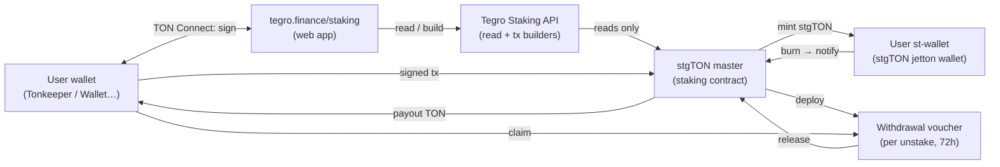
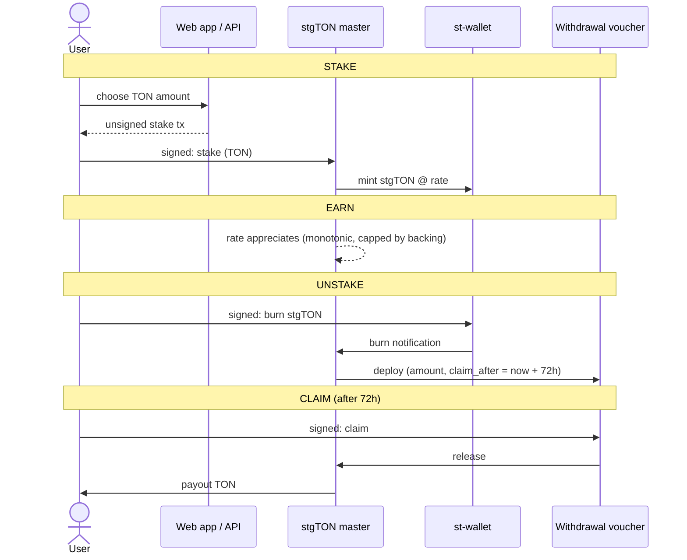

# Architecture

Tegro liquid staking is a set of on-chain TON contracts plus a thin, stateless HTTP API that only
**reads** state and **builds** transactions — the user's wallet signs everything. No custody, no
off-chain control of funds.

## Components

The API never holds keys and never moves funds: it returns an unsigned [TON Connect](https://docs.ton.org/develop/dapps/ton-connect/overview)
transaction that the user signs in their own wallet.

## Lifecycle

## The rate

`1 stgTON = rate(t) × TON`. The rate is stored on-chain and is:

- **monotonic** — it never decreases during normal operation;
- **bounded** — capped by the protocol's attested backing, so it can't exceed real assets;
- **applied live** — stake and unstake both use the current rate, so there is no timing arbitrage.

Yield is delivered through the rate, not by minting extra tokens: your stgTON balance is constant and
its **worth in TON** grows.

## Withdrawal vouchers

Each unstake mints a dedicated voucher contract holding `{ owner, amount, claim_after, claimed }`.
A voucher:

- is claimable only by its `owner`;
- only after `claim_after` (unstake + 72h);
- only once (double-claim and early-claim revert on-chain);
- has a deterministic address, discoverable from the master's transactions.

## Trust model

| Property | Guarantee |
|---|---|
| Custody | Non-custodial — wallet signs every action |
| Solvency | `get_solvency()` getter exposes liability vs. liquidity vs. pending on-chain |
| Exit | 72h unbonding queue; payout fixed at unstake time |
| Privileged ops | Time-locked, narrowly scoped (safety, not routine) |
| Review | Independent adversarial review; no unprivileged fund-drain found |

See the [security model](security.md) for details.
